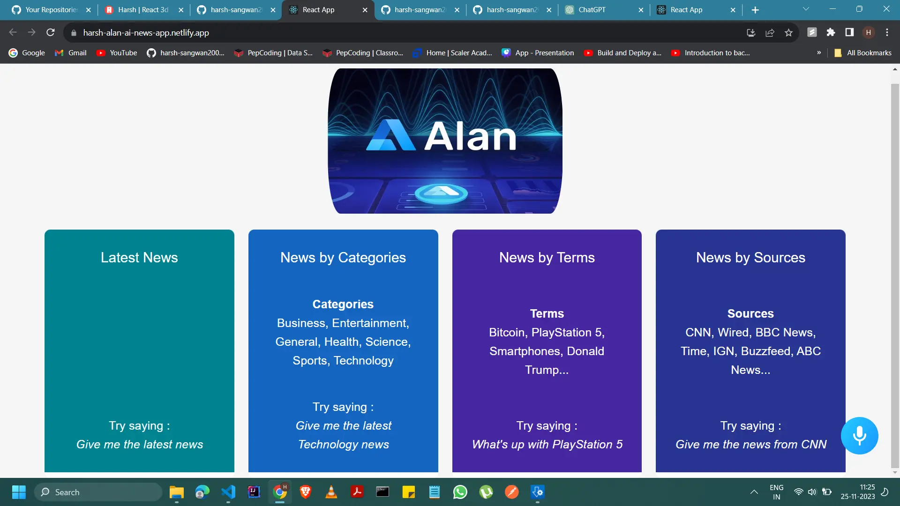

# Alan AI News App

## Live Website

- [Link](https://harsh-alan-ai-news-app.netlify.app/)

A quick guide to my Project ->



## Tools Used

- ReactJS
- JSX
- NewsAPI Org
- CSS
- Alan AI

# Getting Started with Create React App

This project was bootstrapped with [Create React App](https://github.com/facebook/create-react-app).

## Available Scripts

In the project directory, you can run:

### `npm start`

Runs the app in the development mode.\
Open [http://localhost:3000](http://localhost:3000) to view it in your browser.

The page will reload when you make changes.\
You may also see any lint errors in the console.

### `npm test`

Launches the test runner in the interactive watch mode.\
See the section about [running tests](https://facebook.github.io/create-react-app/docs/running-tests) for more information.

### `npm run build`

Builds the app for production to the `build` folder.\
It correctly bundles React in production mode and optimizes the build for the best performance.

The build is minified and the filenames include the hashes.\
Your app is ready to be deployed!

See the section about [deployment](https://facebook.github.io/create-react-app/docs/deployment) for more information.

## Usage

Embark on an immersive experience with our cutting-edge project, merging Alan AI's intelligent voice capabilities with the versatility of React.js and CSS finesse. Leveraging the power of the new SAPI, we've crafted a seamless interface that redefines interaction paradigms.

Click on

```js
npm start
``` 
to run the website